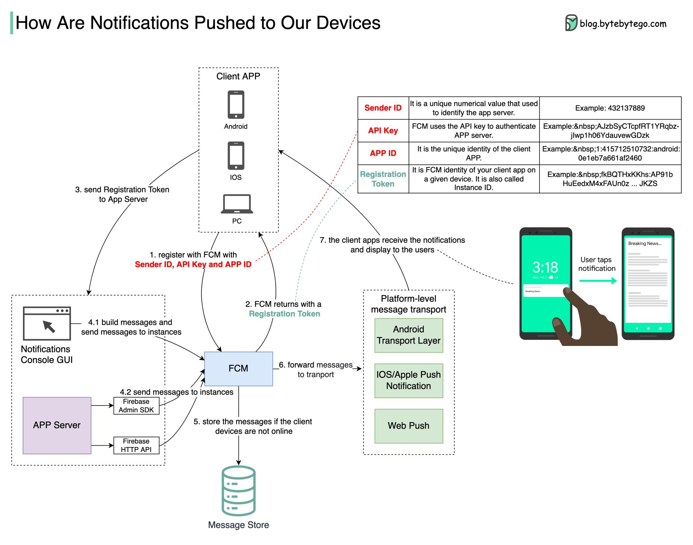

### How notification pushed to our device

- FCM(Firebase Cloud Messaging): user device register on FCM, got the registration token, then send to app service
- App server attach the token when sending message to FCM，
  - Currently if device is online, the keep-alive connection exists, then FCM will push message by transport(3 platforms android/ios/web push)
  - Otherwise if device is offline, FCM will store the messages into DB first

- Performance Optimization
  - Heartbeat interval: 
    - The keep-alive connection will report heartbeat in interval. It would cause disconnected if the duration set too long, or cause 
    more battery consumption if heartbeat report too frequent. 
    - The idea is to adjust heartbeat interval based on current network condition. If device is in good network condition, set longer interval
    for next few rounds, otherwise reduce the interval since it's in poor network.
  - Avoid duplicate pushing:
    - In poor network conditions, sometimes one message could be pushed repeatly. 
    - Adjust based on deviced reported message sequence

